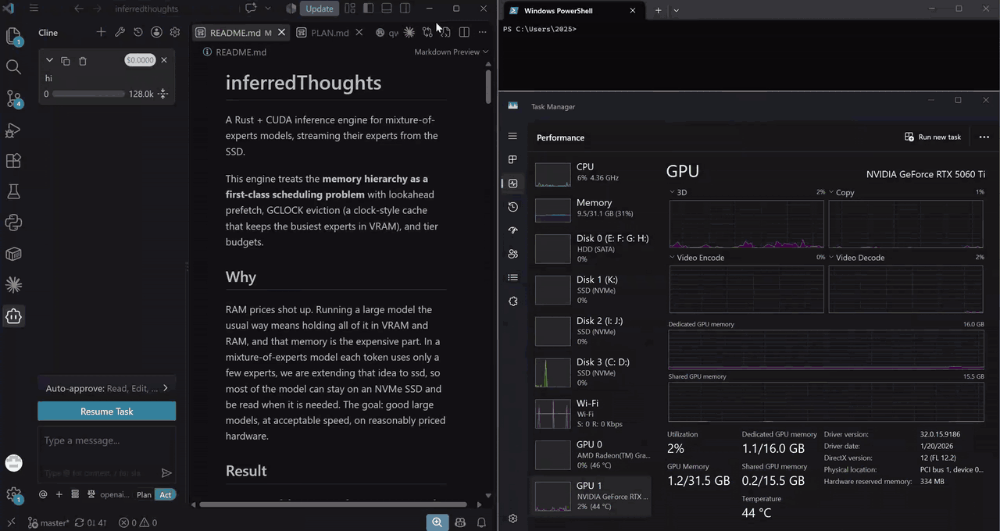

# inferredThoughts

A Rust + CUDA inference engine for mixture-of-experts models, streaming their
experts from the SSD.

This engine treats the __memory hierarchy as a first-class scheduling problem__ with lookahead prefetch, GCLOCK eviction (a clock-style cache that keeps the busiest experts in VRAM), and tier budgets.

---

## Why

RAM prices shot up. Running a large model the usual way means holding all of it in VRAM and RAM, and that memory is the expensive part.

In a mixture-of-experts model each token uses only a few experts. We extend that idea to the SSD: most of the model stays on an NVMe SSD and is read when it is needed.

The goal: good large models, at acceptable speed, on reasonably priced hardware.

---

## Result

### A 177B model on 38 GB of RAM + VRAM: 99 GiB of its 119 GiB file streams from the SSD, only 20 GiB sits in memory, and it still decodes ~9-10 tokens a second.




*Cline in VS Code talking to the 177B through `inferred serve`, native Windows, played at 5x.*

- **Model:** Qwen3.8-Flash-Next, 176.9B parameters, NVFP4
- **Hardware:** a 16 GB RTX 5060 Ti with 32 GB of RAM, about 22 GB of it usable once Windows takes its ~10 GB

| part of the file | size | where it lives |
|---|---:|---|
| dense weights (attention, shared experts, LM head) | 4.4 GiB | VRAM |
| token embedding table | 0.6 GiB | RAM, one row read per token |
| hottest routed experts | 8.8 GiB | VRAM |
| next-hottest routed experts | 6.0 GiB | pinned RAM |
| remaining routed experts | 48.5 GiB | SSD, streamed on demand |
| n-gram table | 50.7 GiB | SSD, 16 rows read per token |

How it works: [`docs/ARCHITECTURE.md`](docs/ARCHITECTURE.md).

That is the proof this route is worth pursuing: next come bigger models on the same card. **This is the first cut.** We expect it to get faster and better from here.

---

## Tested so far

Two models, on one machine: RTX 5060 Ti 16 GB, Ryzen 7 9700X, 32 GB DDR5,
Gen5 NVMe.

**Only tested on:**
- **Windows 11 (native) and WSL2 (Ubuntu 24.04).** Native Linux is not tested.
- **NVIDIA RTX 50-series / RTX PRO Blackwell (`sm_120`).** The kernels are
  built for `sm_120a`; older GPUs are not supported yet.

| model | GGUF | prefill tok/s | decode tok/s |
|---|---|---:|---:|
| Qwen3.8-Flash-Next, NVFP4, 176.9B | [download, 119 GiB](https://huggingface.co/CompiledThoughts/Qwen3.8-Flash-Next-NVFP4-Q8_0) | 49.2 | **9.06** (best turn 10.40) |
| Qwen3.6-35B-A3B, NVFP4 | [download, 19.1 GiB](https://huggingface.co/CompiledThoughts/Qwen3.6-35B-A3B-NVFP4-Q8_0-it) | 591.2 | **47.3** |

Native Windows 11, default settings. Prefill is a 5,548-token prompt; decode is a chat turn, and on the 176.9B it falls as a conversation grows.

On the same machine, natively on Windows, llama.cpp averaged 4.9 tok/s decoding the 176.9B, against 9.06 for this engine.

---

## Quick start

### What you need

- An RTX 50-series or RTX PRO Blackwell GPU; NVIDIA driver R570+; CUDA 12.8+
- Rust (stable). On Windows: VS 2022 Build Tools, building from the *x64 Native Tools Command Prompt*
- For the 176.9B: 32 GB of RAM and a fast local NVMe. Under WSL, keep models on ext4 (`~/models`), not `/mnt/c`.
- To download models: Python 3.9+ (for the `hf` command), or `curl`; and free disk space: 128 GB for the 176.9B, 20.5 GB for the 35B.

### Get a model

Both GGUFs are on Hugging Face, no login needed. Model pages:
[Qwen3.8-Flash-Next-NVFP4-Q8_0](https://huggingface.co/CompiledThoughts/Qwen3.8-Flash-Next-NVFP4-Q8_0)
(176.9B) and
[Qwen3.6-35B-A3B-NVFP4-Q8_0-it](https://huggingface.co/CompiledThoughts/Qwen3.6-35B-A3B-NVFP4-Q8_0-it)
(35B); all models: [huggingface.co/CompiledThoughts](https://huggingface.co/CompiledThoughts).

```bash
pip install -U huggingface_hub

# Qwen3.8-Flash-Next, 176.9B (119 GiB = 128 GB)
hf download CompiledThoughts/Qwen3.8-Flash-Next-NVFP4-Q8_0 Qwen3.8-Flash-Next-NVFP4-Q8_0.gguf --local-dir models

# Qwen3.6-35B-A3B (19.1 GiB = 20.5 GB)
hf download CompiledThoughts/Qwen3.6-35B-A3B-NVFP4-Q8_0-it Qwen3.6-35B-A3B-NVFP4-Q8_0-it.gguf --local-dir models
```

If a download is interrupted, run the same command again and it resumes.
Without Python, `curl -L -C - -O <url>` also resumes, with the URL
`https://huggingface.co/<repo>/resolve/main/<file>`. Under WSL, use
`--local-dir ~/models`.

To check the 176.9B file (Linux or WSL), fetch the checksum beside it and
verify:

```bash
hf download CompiledThoughts/Qwen3.8-Flash-Next-NVFP4-Q8_0 SHA256SUMS --local-dir models
cd models && sha256sum -c SHA256SUMS
```

### Build and run

```bash
cargo build --release --features cuda
./target/release/inferred serve -m models/Qwen3.8-Flash-Next-NVFP4-Q8_0.gguf --backend cuda --port 8080 --ctx 8192
```

On Windows the binary is `target\release\inferred.exe`. Open
`http://127.0.0.1:8080/` for the chat page; any OpenAI-compatible client can
use `http://127.0.0.1:8080/v1`.

Prompts are rendered with each model's own chat template, so an agent client
(Cline, or anything that sends OpenAI `tools`) gets **tool calls** back as
`tool_calls`, in the format the model was trained on, and reasoning as
`reasoning_content`.

**Thinking** is on by default, and it costs tokens before every answer:

| | server default | per request |
|---|---|---|
| turn thinking off (both models) | `--think off` | `"chat_template_kwargs": {"enable_thinking": false}` |
| shorter thinking (176.9B: `xhigh`, `medium`, `low`) | `--reasoning-effort low` | `"reasoning_effort": "low"` |
| reply length | `--max-tokens N`; default: until the context is full | `"max_tokens": N` |

For `--ctx` and `--expert-host`, see
[Context length and the KV cache](#context-length-and-the-kv-cache).

Tests: `cargo test --release --features cuda` (198, no GPU needed).

---

## Limits and next

- Tested on two models, one GPU family, Windows and WSL2 only.
- Greedy decoding only. Tool calls stream as they are written; `tool_choice` other than `"none"` is left to the model.
- Next: bigger models, older NVIDIA GPUs, native Linux.

---

## Details

### The weight format: NVFP4

Both models keep their routed experts in NVFP4: each weight is a 4-bit float
(E2M1), and every 16 weights share an 8-bit FP8 (E4M3) scale, so **4.5 bits
per weight** (4 + 8/16). The 176.9B's experts bear it out: 120.8B parameters in
63.28 GiB is 4.50 bits each.

| format | bits per weight | scale |
|---|---:|---|
| IQ4_XS | 4.25 | per 32 weights |
| MXFP4 | 4.25 | one power-of-two scale per 32 |
| **NVFP4** | **4.5** | one FP8 scale per 16, finer, so more accurate |
| Q8_0 | 8.5 | one fp16 scale per 32 |

The extra quarter-bit buys a format Blackwell's tensor cores multiply
directly: the matmuls run FP4 × FP4 on the tensor cores (the `sm_120a`
instruction), with no unpacking to 8 or 16 bits first.

### Context length and the KV cache

`--ctx` reserves the whole KV cache at start-up, in VRAM the experts would
otherwise use. Measured per position: 20 KiB on the 35B, 28.5 KiB on the
176.9B, plus a fixed recurrent state (84 and 150 MiB):

| `--ctx` | 35B KV | 176.9B KV |
|---:|---:|---:|
| 8,192 | 160 MiB | 228 MiB |
| 32,768 | 640 MiB | 912 MiB |
| 65,536 | 1,280 MiB | 1,824 MiB |
| 128,000 | 2,500 MiB | 3,562 MiB |

Decode as a conversation gets deeper, through `serve`:

| model | context depth | decode tok/s | measured |
|---|---:|---:|---|
| 35B NVFP4 | ~4k | 47.5 | WSL2, 12-09-2026 |
| | ~20k | 43.5 | WSL2, 12-09-2026 |
| | ~36k | 41.0 | Windows, 26-09-2026 (`--ctx 64096 --expert-host 10`) |
| | ~86k | 35.2 | WSL2, 12-09-2026 |
| | ~100k | 33.8 | WSL2, 12-09-2026 |
| 176.9B | ~0.2k | 10.40 | Windows, 24-09-2026 |
| | ~6k | 8.35 | Windows, 27-09-2026 (a 1,111-token reply) |
| | ~29k | 6.88 | Windows, 27-09-2026 (Cline, 33 turns, 6 tools) |

Keep `--ctx` as small as the session needs. If decode slows sharply at a
large `--ctx`, raise `--expert-host` (the pinned-RAM expert tier, 6 GiB by
default). The ~36k row, on Windows: at this `--ctx` the default tier left
experts on the SSD and decode fell to ~26 tok/s; 10 GiB fixed it:

```bat
target\release\inferred.exe serve -m models\Qwen3.6-35B-A3B-NVFP4-Q8_0-it.gguf --backend cuda --port 8080 --ctx 64096 --expert-host 10 -v
```

On the 35B, decode costs ~21.3 ms plus ~0.08 µs per position of context;
prefill falls from ~724 tok/s at the start of a conversation to ~237 by 86k.

---

## Acknowledgements

- [llama.cpp](https://github.com/ggml-org/llama.cpp): the behavioural reference every kernel was checked against.
- [colibri](https://github.com/JustVugg/colibri): the lookahead direction behind the expert prefetch.
- [SGLang](https://github.com/sgl-project/sglang): its day-0 notes on Qwen3.8-Flash-Next.
- [Claude](https://claude.ai) (Anthropic): used to speed up development.
- And many more.

---

## License

Apache 2.0, see [`LICENSE`](LICENSE).
